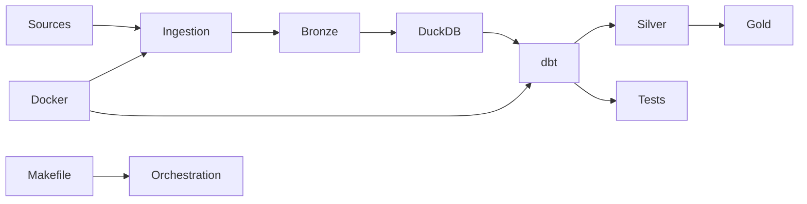

# Modern Lakehouse Architecture  
DuckDB + dbt-core + Python + Docker

A production-style Modern Lakehouse designed to simulate how a Data Platform team at a Series C SaaS company would structure analytics infrastructure using cost-efficient, local-first tooling.

This project implements a Medallion Architecture (Bronze → Silver → Gold) with reproducibility, data quality enforcement, and incremental-ready modeling.

---

## Objectives

- Implement a clean Medallion Architecture
- Follow ELT best practices
- Use columnar Parquet storage
- Support incremental transformations
- Apply partition-aware modeling
- Enforce automated data quality tests
- Provide reproducible local execution
- Maintain professional Git discipline and ADR documentation

This repository is structured to resemble a real-world Data Platform codebase rather than a toy pipeline.

---

## Architecture Overview



### Layer Responsibilities

#### Bronze (Raw Zone)
- Immutable raw Parquet files
- Append-only ingestion
- Partitioned by ingestion date
- Minimal validation
- No business logic

#### Silver (Conformed Zone)
- Type standardization
- Deduplication
- Canonical entity definitions
- Data quality enforcement via dbt tests

#### Gold (Business Marts)
- Fact and dimension tables
- Business-ready metrics
- Incremental-ready models
- Stable analytical interface

---

## Technology Stack

| Component | Purpose |
|------------|----------|
| DuckDB | Local analytical engine |
| dbt-core | Transformations, testing, documentation |
| Python | Ingestion layer |
| Parquet | Columnar storage format |
| Docker | Reproducible environment |
| Makefile | Developer experience orchestration |
| GitHub Actions | CI quality gates (planned) |

---

## Repository Structure

```
modern-lakehouse-architecture/
│
├── ingestion/           # Python extraction & Bronze loading
├── lakehouse/
│   ├── bronze/
│   ├── silver/
│   └── gold/
│
├── dbt/
│   ├── models/
│   │   ├── bronze/
│   │   ├── silver/
│   │   └── gold/
│   └── tests/
│
├── docker/
├── scripts/
├── docs/
│   ├── architecture/
│   └── decisions/
│
├── Makefile
├── docker-compose.yml
└── README.md
```

---

## Development Workflow

### Setup environment

```bash
make setup
```

### Run ingestion (Bronze)

```bash
make ingest
```

### Run transformations

```bash
make dbt-run
```

### Execute data quality tests

```bash
make dbt-test
```

### Run full pipeline

```bash
make full-pipeline
```

---

## Architectural Principles

### Medallion Architecture
Clear separation between raw, conformed, and business layers to ensure maintainability and scalability.

### ELT Pattern
Raw data is landed first and transformed later using SQL models in dbt.

### Incremental Modeling
Gold models are designed to support incremental loads and partition pruning.

### Partition Strategy
Parquet files are partitioned by:
- ingestion_date
- domain-specific keys

Enables efficient query pruning in DuckDB.

### Data Contracts
dbt `schema.yml` enforces:
- not_null
- unique
- relationships

### Reproducibility
Docker guarantees deterministic local execution.

### Clean Git Discipline
- Trunk-based development
- Conventional commits
- Architecture Decision Records (ADR)

---

## Example Domain (SaaS Analytics)

The project simulates a SaaS analytics domain including:

- Users
- Subscriptions
- Events
- Invoices
- Revenue Marts

Designed to model:
- Monthly Recurring Revenue (MRR)
- Churn
- Cohort retention
- Subscription lifecycle analytics

---

## What This Project Demonstrates

- Data Platform mindset
- Production-grade repository structure
- Governance and data quality awareness
- Incremental modeling patterns
- Cost-efficient architecture choices
- Cloud migration readiness

---

## Future Enhancements

- CI/CD integration
- Structured logging
- Observability metrics
- Data lineage graph
- Unit testing ingestion layer
- Object storage simulation (S3-style)

---

## Interview Framing

This project demonstrates the ability to design and implement a modular, containerized lakehouse architecture using medallion modeling principles, incremental transformations, and automated data quality enforcement.

The focus is not just on building pipelines, but on structuring a maintainable and scalable analytics platform.
