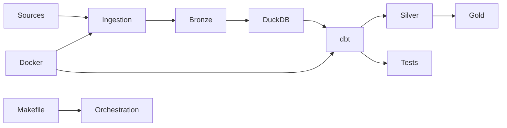

# Modern Lakehouse Architecture  
DuckDB + dbt-core + Python + Docker

A production-style Modern Lakehouse designed to simulate how a Data Platform team at a Series C SaaS company would structure analytics infrastructure using cost-efficient, local-first tooling.

This project implements a Medallion Architecture (Bronze → Silver → Gold) with reproducibility, data quality enforcement, incremental-ready modeling, SaaS revenue analytics, and CI-based validation.

---

## Objectives

- Implement a clean Medallion Architecture
- Follow ELT best practices
- Use columnar Parquet storage
- Support incremental transformations
- Apply partition-aware modeling
- Enforce automated data quality tests
- Provide reproducible local execution
- Maintain professional Git discipline and ADR documentation

This repository is structured to resemble a real-world Data Platform codebase rather than a toy pipeline.

---

## Architecture Overview



### Layer Responsibilities

#### Bronze (Raw Zone)
- Immutable raw Parquet files
- Append-only ingestion
- Partitioned by ingestion date
- Minimal validation
- No business logic

#### Silver (Conformed Zone)
- Type standardization
- Deduplication
- Canonical entity definitions
- Data quality enforcement via dbt tests

#### Gold (Business Marts)
- Fact and dimension tables
- Business-ready metrics
- Incremental-ready models
- Stable analytical interface

---

## Technology Stack

| Component | Purpose |
|------------|----------|
| DuckDB | Local analytical engine |
| dbt-core | Transformations, testing, documentation |
| Python | Ingestion layer |
| Parquet | Columnar storage format |
| Docker | Reproducible environment |
| Makefile | Developer experience orchestration |
| GitHub Actions | CI quality gates via automated dbt build |

---

## Repository Structure

```
modern-lakehouse-architecture/
│
├── ingestion/           # Python extraction & Bronze loading
├── lakehouse/
│   ├── bronze/
│   ├── silver/
│   └── gold/
│
├── dbt/
│   ├── lakehouse_project/
│   │   ├── models/
│   │   │   ├── bronze/
│   │   │   ├── silver/
│   │   │   └── gold/
│   │   └── dbt_project.yml
│   └── profiles.yml
│
├── Docker/
├── Scripts/
├── Docs/
│   ├── architecture/
│   └── decisions/
│
├── .github/workflows/
├── Makefile
├── docker-compose.yml
└── README.md
```

---

## Development Workflow

### Setup environment

```bash
make setup
```

### Run ingestion (Bronze)

```bash
make ingest
```

### Run transformations

```bash
make dbt-run
```

### Execute data quality tests

```bash
make dbt-test
```

### Run full pipeline

```bash
make full-pipeline
```

---

## Architectural Principles

### Medallion Architecture
Clear separation between raw, conformed, and business layers to ensure maintainability and scalability.

### ELT Pattern
Raw data is landed first and transformed later using SQL models in dbt.

### Incremental Modeling
Gold models are designed to support incremental loads using `delete+insert` strategy (DuckDB-compatible).

### Partition Strategy
Parquet files are partitioned by:
- ingestion_date
- domain-specific keys

Enables efficient query pruning in DuckDB.

### Data Contracts
dbt `schema.yml` enforces:
- not_null
- unique
- relationships

### Reproducibility
Docker guarantees deterministic local execution.

### Clean Git Discipline
- Trunk-based development
- Feature branches
- Conventional commits
- CI validation on pull requests

---

## Example Domain (SaaS Analytics)

The project simulates a SaaS analytics domain including:

- Users
- Subscriptions
- Events
- Invoices
- Revenue Marts

Designed to model:

- Monthly Recurring Revenue (MRR)
- Logo Churn
- Net Revenue Retention (NRR)
- Gross Revenue Retention (GRR)
- Revenue Expansion & Contraction
- Annual Recurring Revenue (ARR)
- Cohort-based revenue retention

---

## Revenue Modeling

### Account-Level Metrics (account_id × month)

- MRR (source of truth)
- NRR bridge components:
  - starting_mrr
  - new_logo_mrr
  - reactivation_mrr
  - expansion_mrr
  - contraction_mrr
  - churn_mrr
  - ending_mrr_for_nrr
  - nrr_ratio
  - grr_ratio
- ARR (ARR = MRR × 12)

### Portfolio-Level Metrics (month)

- Total ARR
- Portfolio NRR
- Portfolio GRR

### Cohort Analytics (cohort_month × month)

- Cohort-based NRR retention curves
- Subscription lifecycle revenue analysis

All revenue models:
- Maintain explicit grain definitions
- Use incremental delete+insert strategy
- Are fully covered by dbt tests

---

## Continuous Integration

The repository includes a GitHub Actions workflow that:

- Builds the Docker image
- Runs `dbt debug`
- Executes `dbt build` (models + tests)
- Uploads dbt artifacts for debugging

This ensures:

- Automated data quality gates on pull requests
- Deterministic builds
- Early failure detection

---

## What This Project Demonstrates

- Data Platform mindset
- Production-grade repository structure
- Governance and data quality enforcement
- Incremental modeling patterns under adapter constraints
- SaaS revenue modeling literacy
- CI-based validation and reproducibility
- Migration-ready architecture design

---

## Design Trade-offs

This architecture intentionally makes several pragmatic trade-offs to balance cost, complexity, and scalability.

### 1. DuckDB Instead of Cloud Warehouse

**Why:**
- Zero infrastructure cost
- Local-first development
- Native Parquet support
- Fast analytical performance

**Trade-off:**
- Not distributed
- Not suitable for multi-user production workloads

**Rationale:**
The goal is to simulate architectural maturity without infrastructure overhead. The system is designed so that migration to Snowflake, BigQuery, or Databricks would require minimal refactoring.

---

### 2. ELT Instead of ETL

**Why:**
- Preserve raw data integrity in Bronze
- Enable reproducibility and reprocessing
- Push transformation logic into SQL (dbt)

**Trade-off:**
- Requires a performant query engine
- Slightly more storage usage

**Rationale:**
Modern data platforms favor ELT to maximize auditability and flexibility.

---

### 3. Parquet as Storage Format

**Why:**
- Columnar storage
- Compression efficiency
- Partition pruning capability
- Industry standard format

**Trade-off:**
- Requires schema discipline
- Harder to manually inspect than CSV

**Rationale:**
Parquet enables efficient analytical workloads and aligns with lakehouse best practices.

---

### 4. Medallion Architecture (Bronze → Silver → Gold)

**Why:**
- Clear separation of concerns
- Easier debugging and reprocessing
- Business logic isolated from raw ingestion

**Trade-off:**
- More layers to maintain
- Additional storage footprint

**Rationale:**
This pattern improves governance and long-term maintainability.

---

### 5. Incremental Modeling Strategy

**Why:**
- Avoid full-table rebuilds
- Enable scalable growth
- Simulate production warehouse behavior

**Trade-off:**
- Requires careful key design
- Increased modeling complexity

**Rationale:**
Incremental models reflect real-world production constraints.

---

### 6. Local Orchestration via Makefile

**Why:**
- Simple reproducibility
- Clear developer interface
- No external scheduler dependency

**Trade-off:**
- Not production orchestration (e.g., Airflow/Prefect)

**Rationale:**
The focus is platform structure, not orchestration tooling.

---

### 7. Dockerized Environment

**Why:**
- Deterministic builds
- Eliminates environment drift
- Portable across machines

**Trade-off:**
- Slightly more setup overhead

**Rationale:**
Reproducibility is a core Data Platform principle.

---

### Scalability Path

This architecture can evolve by:

- Replacing DuckDB with a cloud warehouse
- Moving Parquet storage to object storage (S3/GCS/Azure)
- Adding orchestration (Airflow/Prefect)
- Integrating observability tooling
- Expanding CI/CD to include deployment workflows

The repository is structured to allow these transitions with minimal redesign.